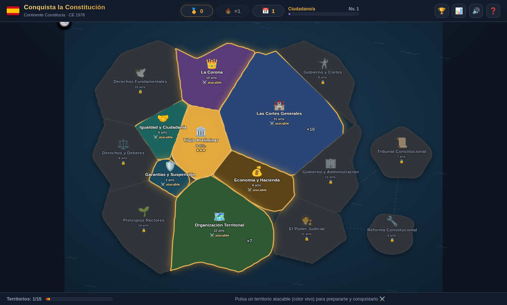
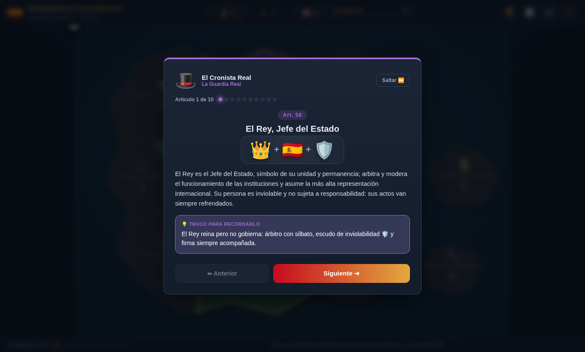
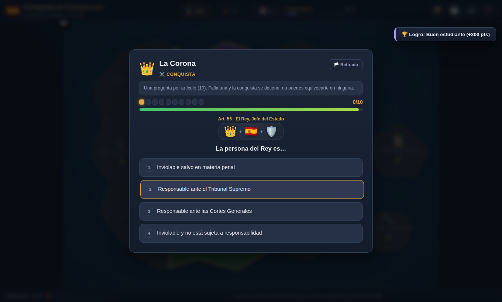

<div align="center">

# ⚔️ La Constitución: WarChallenge

**Aprende la Constitución Española de 1978 conquistando un continente.**

Un juego de estrategia tipo *Risk* donde cada territorio es un título de la
Constitución y se conquista respondiendo, sin fallar, una pregunta por artículo.

[](https://github.com/ignaciodmj83/La_Constitucion_War_Challenge/actions/workflows/ci.yml)
[](https://ignaciodmj83.github.io/La_Constitucion_War_Challenge/)


### 👉 [**Jugar ahora**](https://ignaciodmj83.github.io/La_Constitucion_War_Challenge/)



</div>

---

## ¿Qué es esto?

La Constitución Española es aquí un continente, **Constitucia**, dividido en 15
territorios (los títulos de la Constitución) y 2 islas. La **superficie de cada
territorio es proporcional a su número de artículos**, así que el mapa es, a la
vez, un mapa mental de toda la Constitución.

Para conquistar un territorio primero te **preparas** con su profesor, que te
explica sus artículos uno a uno, y luego **atacas**: una pregunta por cada
artículo, sin fallar ninguna.

| Preparación con el profesor | Batalla de conquista |
|---|---|
|  |  |

## Cómo se juega

1. **Elige un territorio** con color vivo (fronterizo con los tuyos).
2. **Prepárate** 🎓: el profesor del territorio te explica cada artículo con una
   escena visual y un truco para recordarlo por asociación.
3. **Conquista** ⚔️: responde una pregunta por artículo. **Un solo fallo detiene
   el ataque** — por eso conviene prepararse antes.
4. **Expande** tu territorio, defiende lo conquistado de **El Olvido** (que borra
   tu memoria con el tiempo real) y domina el continente entero.

Atajos: teclas `1`–`4` para responder, `Enter` para continuar, `←`/`→` en la
preparación.

## Características

- 🗺️ **Mapa continental** con territorios contiguos, 2 islas y rutas marítimas.
- 📜 **Los 169 artículos** de la Constitución, cada uno con explicación, escena
  visual mnemotécnica, truco de asociación y pregunta tipo test.
- 🎓 **Modo preparación** con un profesor de personalidad propia por territorio.
- ⚔️ **Conquista estricta**: una pregunta por artículo, sin fallar ninguna.
- 🪖 **Tropas temáticas** visibles en cada territorio (Guardia Real, Los Togados…).
- 🔥 Combos, 🎖️ rangos, 🏆 14 logros, 📅 racha diaria y 🌫️ repaso espaciado.
- 💾 Guardado automático en el navegador · 🔊 sonido y 🎉 confeti · **sin conexión**.

## Jugar en tu ordenador

No necesita instalación de dependencias. Solo [Node.js](https://nodejs.org) (18+):

```bash
git clone https://github.com/ignaciodmj83/La_Constitucion_War_Challenge.git
cd La_Constitucion_War_Challenge
npm run serve          # abre http://localhost:8080
```

O, más sencillo aún: ejecuta `npm run build` y abre el archivo `dist/index.html`
con doble clic (funciona sin servidor y sin internet).

## Comandos disponibles

| Comando | Qué hace |
|---|---|
| `npm run serve` | Levanta el juego en `http://localhost:8080`. |
| `npm test` | Valida que los 169 artículos y el mapa son coherentes. |
| `npm run build` | Genera `dist/index.html` (todo el juego en un solo archivo). |
| `npm run map` | Regenera el mapa del continente (`js/map-data.js`). |

## Estructura del proyecto

```
La_Constitucion_War_Challenge/
├── index.html          # el juego
├── css/game.css        # estilos (mapa, tropas, escenas)
├── js/
│   ├── map-data.js     # continente generado (formas y adyacencias)
│   ├── data.js         # territorios, facciones, profesores y 169 artículos
│   └── game.js         # motor del juego
├── tools/gen-map.js    # generador del mapa (Voronoi ponderado por artículos)
├── scripts/            # servidor local y generador del bundle
├── tests/validate.js   # pruebas de integridad del contenido
└── docs/ROADMAP.md     # hoja de ruta (incl. camino a la App Store)
```

## Tecnología

Web 100 % estática: **HTML, CSS y JavaScript** sin frameworks ni dependencias.
El mapa se genera con un diagrama de **Voronoi ponderado** por número de
artículos; el sonido usa **WebAudio** y los efectos, **Canvas**. Al no usar
dependencias externas, el juego funciona sin conexión y es fácil de convertir
en app móvil más adelante (ver [hoja de ruta](docs/ROADMAP.md)).

## Contribuir

Se agradecen correcciones de contenido y mejoras. Lee
[CONTRIBUTING.md](CONTRIBUTING.md) — puedes ayudar incluso sin programar.

## Aviso

Proyecto educativo. El texto de la Constitución (BOE-A-1978-31229) es de dominio
público; las preguntas, explicaciones y el juego son obra original. **No
constituye asesoramiento jurídico.** Consulta la [licencia](LICENSE).
